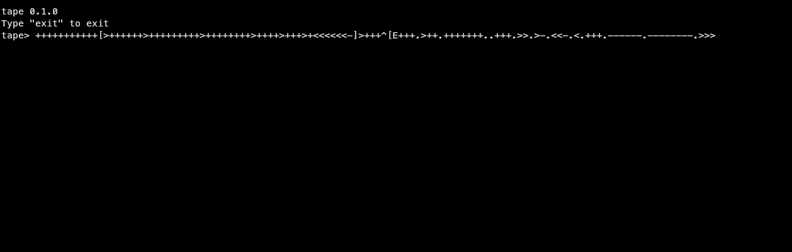

# tape


**tape** is a simple [brainf**k](https://esolangs.org/wiki/Brainfuck) interpreter written in C++ and built with CMake.

## Features
- Working REPL
- Non-recursive structure



## Installation
1. Go to **[the latest release](https://github.com/Kre0ns/tape/releases/latest)**
2. Download the variant for your platform (Windows / Linux)
3. Unzip at desired location
4. Run via terminal: 
    - **Windows**:
    ```bat
    tape.exe
    ```
    - **Linux**:
    ```bash
    ./tape
    ```

## Planned
- File interpretation
- Detailed error messages
